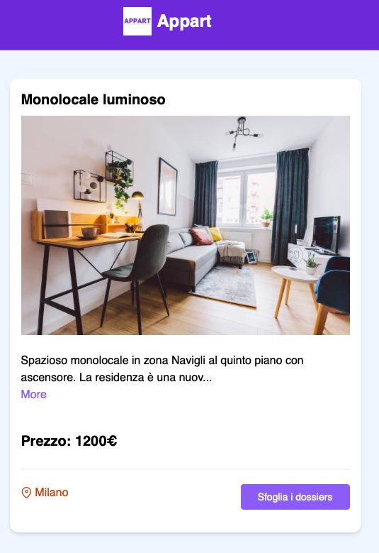
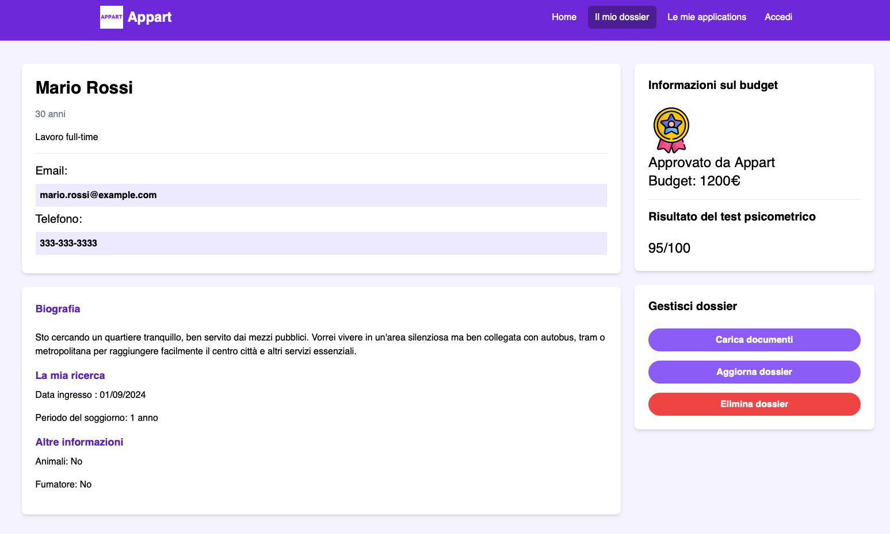

# appart-tenant-scoring
Web version for Appart, a tenant scoring solution.

### Gallery




### Additional resources
Quick start guide with Vue.js: https://vuejs.org/guide/quick-start.html  

## Prerequisites 

- Install Node.js version 18.3 or higher

To install Node.js follow this few commands: https://nodejs.org/en/download/package-manager  

## Project Setup
Clone this repo on your local machine (via terminal or using an IDE), move to the project folder and run the following 3 commands.

```sh
npm install
```
## Mock the DB
You can choose if to run the mocked DB locally or connect to one over the internet.
The one over the internet is at:

https://mocked-be-appart.vercel.app/dossiers

And it has only read permissions.

If you want to run it on your local machine, to try the full CRUD operations, do the following instead:
### Run JSON Server locally

To run the server on http://localhost:8000 run the following command:

Remember to remplace https://mocked-be-appart.vercel.app/dossiers with http://localhost:8000/dossiers and viceversa, for dev and prd mocking in the entire codebase. Use the replace all feature of VScode and exclude the change from this Readme file.

```sh
npm run server
```

## Compile and Hot-Reload for Development

```sh
npm run dev
```
### Compile and Minify for Production

```sh
npm run build
```
## IDE
The recommended IDE setup is Visual Studio Code.
